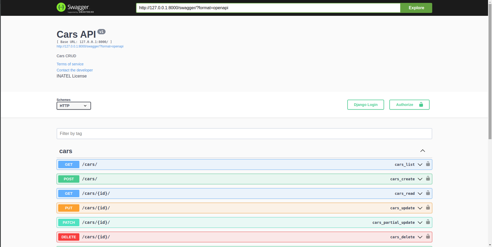

# S206 - Swagger

"Swagger" is a tool and a specification for API (Application Programming Interface) documentation.
It is used to describe, design, and document APIs in a standardized way, making it easier for developers to understand and use them.

<h4 align="left"> 
	Authors :pencil2:
</h4>


<p align="left">
	<a href="https://github.com/Joaohsd">João Henrique Silva Delfino</a> 
</p>
<p align="left">
	<a href="https://github.com/LucasBelino">Lucas Belino da Silva</a> 
</p>
<p align="left">
	<a href="https://github.com/maycolteles">Maycol Teles Costa Dionisio Pereira</a> 
</p>
<p align="left">
	<a href="https://github.com/rgoncalvss">Rafael Carolino Gonçalves</a> 
</p>

*********************

## Summary :clipboard:

* [Requirements](#requirements)
* [Setup and Installation](#setup-installation)
* [How to Use](#how-to-use)
* [Integrating Swagger with Django](#integrating-swagger-with-django)

*********************
##  Requirements :pencil: <a name="requirements"></a>

* [Python 3.10+](https://www.python.org/)
* Pip 23.0+ (comes with Python 3)

*********************
##  Setup and Installation :white_check_mark: <a name="setup-installation"></a>

The setup is possible in two ways. The first one is running the following commands belor and using **make** commands. The Makefile simplifies the setup process through automation and organized target execution.

### Cloning the repo :file_folder:
First off, in order to get a copy of the project to run/test it, clone the repository into a folder on your machine:

```shell
git clone git@github.com:Joaohsd/seminario-s206.git
```

### Creating and Activating the Virtual Environment :open_file_folder:
It is recommended to install the dependencies inside a [virtualenv](https://docs.python.org/3/tutorial/venv.html). So, inside the folder where you cloned the repository, create a new virtualenv:

```shell
python3 -m virtualenv venv
```

If you don't have the virtualenv package installed, you can install it with pip:

```shell
pip install virtualenv
```
    
Now, activate the virtualenv (for Linux/MacOS):

```shell
source venv/bin/activate
```

or (for Windows):

```shell
.\venv\Scripts\activate
```

### Installing Dependencies :wrench:
To install all the necessary project dependencies, run the following command in the terminal (make sure you're running it from whithin your virtualenv):

```shell
pip install -r setup/requirements.txt
```

### Makefile
To install all the necessary project dependencies, run the following command in the terminal (make sure you have make installed):

```shell
make start
```

*********************

## How To Use :man_technologist: <a name="how-to-use"></a>

### Executing the Project :arrow_forward:
To run the application, run the following command under the first `swagger` folder:

```shell
./manage.py runserver
```

or
```shell
python manage.py runserver
```

### Makefile
To run the application with **make**, run the following command:

```shell
make runServer
```

### Accessing Swagger
To access the Swagger interface (after you ran `runserver`), go to `localhost:8000/swagger` and you should be presented with a screen like this:



*********************

##  Integrating Swagger With Django :link: <a name="integrating-swagger-with-django"></a>

### Libraries

There're several libraries that can be used to integrate Swagger with Django. Some of them are listed below:
* [drf-yasg](https://drf-yasg.readthedocs.io/en/stable/)
* [django-rest-swagger](https://django-rest-swagger.readthedocs.io/en/latest/)
* [drf-spectacular](https://drf-spectacular.readthedocs.io/en/latest/)

drf-yasg (which stands for Django REST Framework - Yet Another Swagger Generator) is the one we chose to use in this project.

### How to use DRF-YASG

In order to add Swagger to your Django project using drf-yasg, you need to install the drf-yasg package first:

```shell
pip install drf-yasg
```

Then, add the following lines to your `settings.py` file:

```python
INSTALLED_APPS = [
	# django apps
	...

	# 3rd partyt apps
	'drf_yasg',
	...

	# local apps
	...
]
```

Now, you need to add the following lines to your `urls.py` file:

```python
from django.urls import path
from rest_framework import permissions
from drf_yasg.views import get_schema_view
from drf_yasg import openapi

schema_view = get_schema_view(
	openapi.Info(
		title="<your_api_name",
		default_version='<your_api_version>',
		description="<your_api_description>",
		terms_of_service="<link_to_terms_of_service>",
		contact=openapi.Contact(email="<your_contact_email>"),
		license=openapi.License(name="your_project_license"),
	),
	public=True,
	permission_classes=(permissions.AllowAny,),
)

urlpatterns = [
	# django urls
	...

	# swagger urls
	path('swagger/', schema_view.with_ui('swagger', cache_timeout=0), name='schema-swagger-ui'),
]
```

Finally, you can add additional information by annotating your API endpoints under `views.py` like so:

```python
from drf_yasg import openapi
from drf_yasg.utils import swagger_auto_schema


	@swagger_auto_schema(
        operation_description="This endpoint description",
        responses={
            status.HTTP_200_OK: "Success",
            status.HTTP_400_BAD_REQUEST: "Bad request",
            status.HTTP_404_NOT_FOUND: "Not found",
            status.HTTP_422_UNPROCESSABLE_ENTITY: "Unprocessable entity",
        }
    )
	def post(self, request):
		...
```
